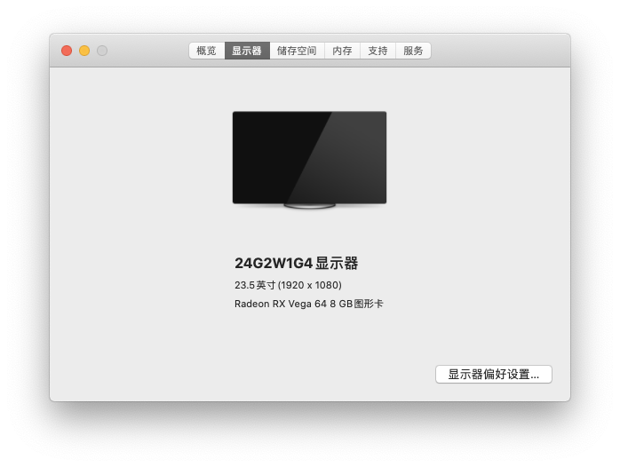
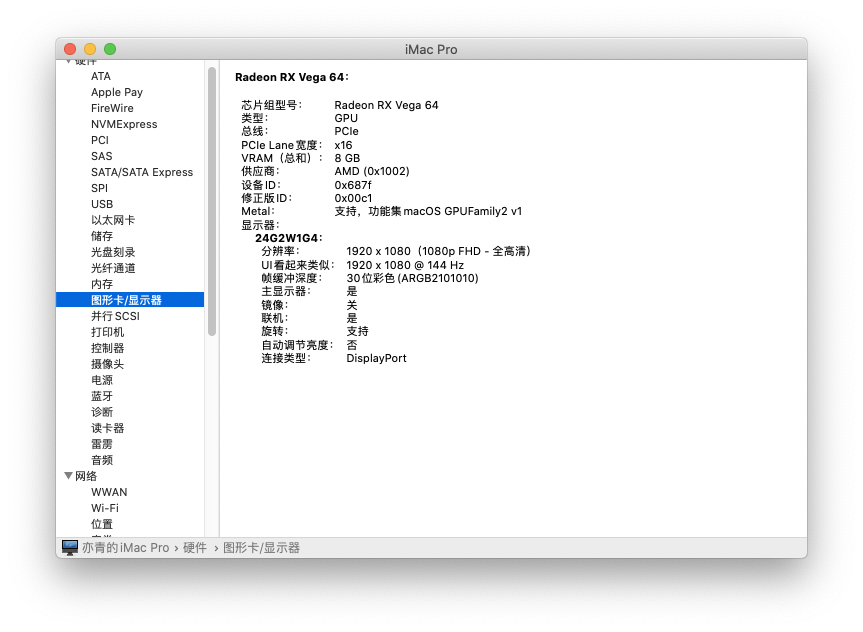
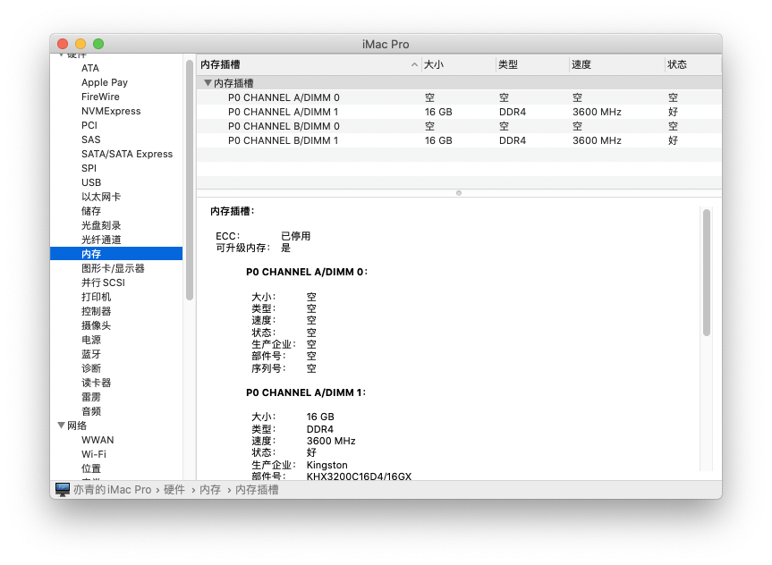

# 适用于Ryzen R7 &amp; B450的OpenCore EFI for macOS 10.15.3

本 EFI 采用 OpenCore 引导，在使用前请阅读[OpenCore 官方文档](https://github.com/acidanthera/OpenCorePkg/blob/master/Docs/Configuration.pdf) – OpenCore 最权威的资料
[OpenCore Configurator](https://mackie100projects.altervista.org/opencore-configurator/) – 适用于 OpenCore 的 config.plist 编辑工具

## 配置

受春节和疫情影响，计划购置的 DW1820A 无法发货，暂时只加入了无线和蓝牙驱动没有办法调试，理论上支持Airdrop 和 Handoff

| Type                 | Name                        |
| -------------------- | --------------------------- |
| CPU                  | AMD Ryzen 3700X             |
| MB                   | MSI B450M MORTAR MAX        |
| Audio                | Realtek ALC892 Codec        |
| GPU                  | PowerColor Radeon Vega 64   |
| RAM                  | 32GB 3600MHz DDR4 (16G * 2) |
| Ethernet             | Realtek RTL8111H-CG         |
| Wireless & Bluetooth | None                        |

| Type                 | Name                                 |
| -------------------- | ------------------------------------ |
| CPU                  | AMD Ryzen 2700                       |
| MB                   | MSI B450I MORTAR MAX                 |
| Audio                | Realtek ALC887 Codec                 |
| GPU                  | XFX Radeon RX 580 8G 2304sp          |
| RAM                  | 16GB 3000MHz DDR4 (16G * 1)          |
| Ethernet             | Realtek 8111H Gigabit LAN controller |
| Wireless & Bluetooth | None                                 |

## 来源

- [x] OpenCore by [OpenCorePkg](https://github.com/acidanthera/OpenCorePkg/releases)
- [x] Audio by [AppleALC](https://github.com/acidanthera/AppleALC) 
- [x] Graphics by [WhateverGreen](https://github.com/acidanthera/WhateverGreen)
- [x] WIFI by [AirportBrcmFixup](https://github.com/acidanthera/AirportBrcmFixup) (brcmfx-country=#a)
- [x] Bluetooth by [BrcmPatchRAM](https://github.com/RehabMan/OS-X-BrcmPatchRAM) and [nickhx from osxlatitude](https://osxlatitude.com/forums/topic/11540-dw1820a-the-general-troubleshooting-thread/page/10/)

## 已知问题

- Realtek ALC887 声卡暂未驱动成功
- 不支持 32-bit
- 不能运行 Android 模拟器，因为 Android 模拟器只支持 VT-X ，但是支持AMD-V的 Genymotion 和 Virtualbox 可以运行

## 截屏

